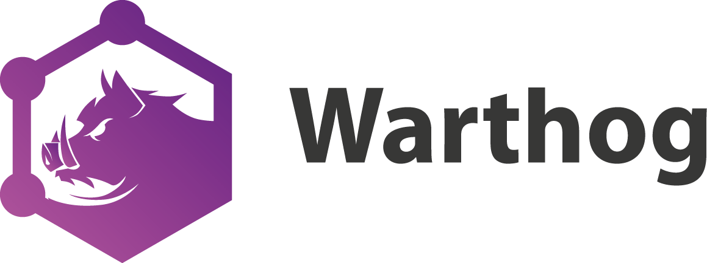

<p align="center">
  <a href="http://warthog.dev/"></a>
</p>

<p align="center">
  This is a minimal example of using the (<a href="https://github.com/goldcaddy77/warthog" target="_blank">Warthog</a> GraphQL API library. Warthog is a Node.js <a href="https://graphql.org" target="_blank">GraphQL</a> Framework for building APIs with strong conventions through auto-generated code.  With Warthog, set up your data models and resolvers, and it does the rest.
</p>

<p align="center">
  <a href="https://circleci.com/gh/goldcaddy77/warthog-starter/tree/master"></a>
  <a href="#badge"></a>
  <a href="https://gitter.im/warthog-graphql/community?utm_source=badge&amp;utm_medium=badge&amp;utm_campaign=pr-badge&amp;utm_content=badge"></a>
</p>

## Play with API

This project is currently running on Heroku at [warthog-starter.herokuapp.com/graphql](https://warthog-starter.herokuapp.com/graphql).  Feel free to play around with it.

## Development Setup

To get things set up in development, where everything will run in `ts-node`, run `yarn bootstrap`.

### Running the server

Run `yarn start:dev` to run the server.

### Using GraphQL Playground

When you run `yarn start:dev`, it will open [graphql-playground](https://github.com/prisma/graphql-playground).  When in the playground, you can issue queries and mutations against the API.

### Running tests

Run `yarn test` to run tests

## Running in Production Mode

In Production mode, you'll need to build and run the compiled code.  To do this locally, run:

```bash
yarn start
```

### Generating Migrations

When you're ready to check in your feature, you'll need to generate a DB migration.  This can automatically be done by running:

```bash
yarn db:migrate:generate user-and-post
```

This will drop a migration in the `db` folder.  To run it and create the schema in your DB, run:

```bash
yarn db:migrate
```

### Generating a new resource

To generate a new `model`, `service` and `resolver`, run `warthog generate <model-name>`.  So for example:

```bash
warthog generate like
```

...or if you want to bootstrap with some fields:

```bash
warthog generate author name! nickname numLogins:int! verified:bool! registeredAt:date balance:float!
```

Some notes about this format:

- First param (`author` above) is always the resource name (required)
- Each subsequent item is a separate field/column that will be added to the model
- The format is fieldName:datatype, with an optional `!` at the end to mark the field required and non-nullable (otherwise it's optional)
- `datatype` must be one of the following: `bool`, `date`, `int`, `float`, `string`
- If `datatype` is missing, it's assumed to be `string`

